# 日本ハーネスの設計判断SSOT（v5版）

HTMLの全本文をMarkdownへ変換した参照用コピー。画面用CSS・JavaScript・タブ切替UIは除き、タブ内本文、表、コード、Mermaid、SVG図は保持する。図や原表示は元HTMLも参照。

原本：[[Sources/Mixed Memos 20261019/Originals/メモ/nihon_harness_design_ssot_v1_0_freeze_onboarding_v5_tabs.html]]

---

## 日本ハーネス 設計判断 SSOT

v1.0 Design Freeze — 設計議論は終結した。本書は Phase 1 実装が従う確定判断と、意図的に後送した事項だけを記載する。以後の変更は設計レビューではなく実装 Issue として扱う。

Version 1.0Mode: FROZENFrozen: 2026-08-25Sign-off: 完了Previous: v0.6

## 0. Design Freeze 宣言

**2026-08-25、設計議論を v1.0 で Freeze した。Phase 1 は GO。Fatal contradiction なし。**
 提案 → 対抗レビュー → 再反証 → 収束レビュー → 最終裁定のサイクルは完了し、**両レビュー系統が Freeze を受領済み**。以後は設計レビューを行わず、実装 Issue へ移行する。

 **以後の目的は「より完全な設計」ではなく「Phase 1を安全に開始できる十分な設計で止める」こと。**
 新しい概念・型・Invariant・Contract・kindを増やすことは原則禁止する。未決事項は、Phase 1を実際に止めるものだけ残す。

| ルール | 運用 |
| --- | --- |
| **CLOSE-01** | 既に方向が合意している事項は、細部未定を理由に再オープンしない。細部は実装時に決められるなら「後送」にする。 |
| **CLOSE-02** | 新しい論点を追加できるのは、§2の確定原則または既存の確定Decisionを破る**具体的な反例**がある場合だけ。 |
| **CLOSE-03** | 「将来必要かもしれない」はOPEN理由にしない。Phase 1で不要ならDeferredへ移す。 |
| **CLOSE-04** | 最後のOpusレビュー後は、残った2論点を裁定し v1.0 へFreezeする。別の対抗レビュー周回を開始しない。 |

### 0-1. 最終裁定サマリ

| 判定項目 | 結果 |
| --- | --- |
| Fatal contradiction | なし§1 / §2 を PRINCIPLE-001〜008 に照らして通し、交差点を個別確認した。矛盾なし。 |
| FINAL-OPEN-01 | 採用v0.6 推奨案をそのまま採用。Base kind 3種 + modifier + process action。→ §4 |
| FINAL-OPEN-02 | 最小修正して採用Fact Claim + Current View Resolver を採用。既定 resolution policy と conflicted の評価を追記。**I-22r は廃止。**→ §5 |
| §2 凍結事項 | Freeze 可能12 + 10 項目を変更なしで v1.0 へ。 |
| Phase 1 | GO§6 の成功条件5項目すべてに達成経路がある。Deferred 項目は妨げない。 |
| 対抗レビュー側の受領 | 受領済2026-08-25、対抗レビュー側が §2 / §4 / §5 / §7 および図 L1〜L4 について食い違いなしを確認し、Freeze を受領。実装 Issue への移行に同意。 |

**この設計の Phase 1 における成否は、もはや設計の精緻さでは決まらない。**
 決めるのは次の2つであり、どちらも実装・運用の問題である。
 ① XLSX の update Egress が実際に通るか ② 最初の Team Playbook が実際に書かれるか

## 図タブ

**図だけを見たい人向けの入口。** 読み手ごとに必要な粒度が違うため、図を **新人向け / 設計向け / 実装向け / 商売向け** の4タブに分けた。
 どのタブも本文の確定Decisionを説明するための図であり、図と本文が食い違う場合は本文を優先する。

**新人向け**
 難しい言葉をできるだけ減らして、「この仕組みで何ができるか」が分かるようにした図です。
 最初は **既存の資料を読み込む → 今回やることを決める → AIが作業する → 確認して戻す** の流れだけ押さえれば大丈夫です。

**この図で分かること** 

- 現場のExcelやWordをそのまま使う 
- チームの決まりに合わせて作業を選ぶ 
- AIが作業しても、最後は確認できる形で残す

**まず見る順番** 

- 全体の流れ 
- 今回の変更から何が決まるか 
- 最後に何が残るか

### 新人向け図1. まず全体像

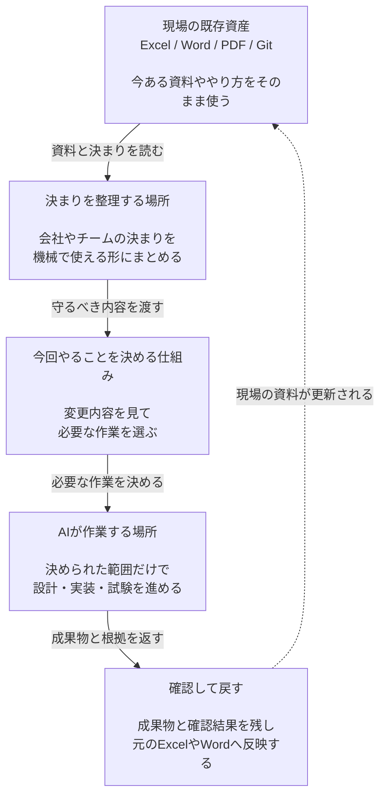
```mermaid
flowchart TB
  A["現場の既存資産<br/>Excel / Word / PDF / Git<br/><br/>今ある資料ややり方をそのまま使う"]
  B["決まりを整理する場所<br/><br/>会社やチームの決まりを<br/>機械で使える形にまとめる"]
  C["今回やることを決める仕組み<br/><br/>変更内容を見て<br/>必要な作業を選ぶ"]
  D["AIが作業する場所<br/><br/>決められた範囲だけで<br/>設計・実装・試験を進める"]
  E["確認して戻す<br/><br/>成果物と確認結果を残し<br/>元のExcelやWordへ反映する"]
  A -->|"資料と決まりを読む"| B
  B -->|"守るべき内容を渡す"| C
  C -->|"必要な作業を決める"| D
  D -->|"成果物と根拠を返す"| E
  E -. "現場の資料が更新される" .-> A
```

要するに、**今の資料を捨てずに、チームのやり方に沿って AI を動かす仕組み**です。

### 新人向け図2. 変更が来たときの流れ

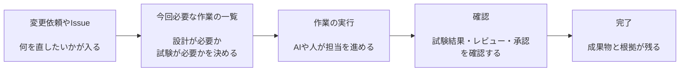
```mermaid
flowchart LR
  I["変更依頼やIssue<br/><br/>何を直したいかが入る"]
  P["今回必要な作業の一覧<br/><br/>設計が必要か<br/>試験が必要かを決める"]
  W["作業の実行<br/><br/>AIや人が担当を進める"]
  G["確認<br/><br/>試験結果・レビュー・承認を確認する"]
  O["完了<br/><br/>成果物と根拠が残る"]
  I --> P --> W --> G --> O
```

この図では、**「何をやるか」を先に決めてから動く**ことが大事です。いきなり AI に全部任せるわけではありません。

**設計向け**
 アーキテクチャ設計に携わる人向けです。責務境界、決定が集まる場所、どこが正式な判断を持つかを確認するための図を置いています。
 現在の確定判断に沿った **既存の図** と、読みやすくした **説明の図** を切り替えられます。

**L1 から L4 へ向かうほどカプセル化を解いた図になる。**ボタンで全図が同時に切り替わる。L1 は経営・他部門への説明用、L2 は日常の共通言語、L3 は責務境界の確認用、L4 は実装者が参照する完全版。
 図はこの文書の判断を可視化したもの。図と本文が食い違う場合は本文の Decision が優先する。

**詳細度**     現在：****

**表示**   説明の図では、箱や矢印の中に「それで何ができるか」を日本語で埋め込んで表示する。

### 図1. 全体アーキテクチャ

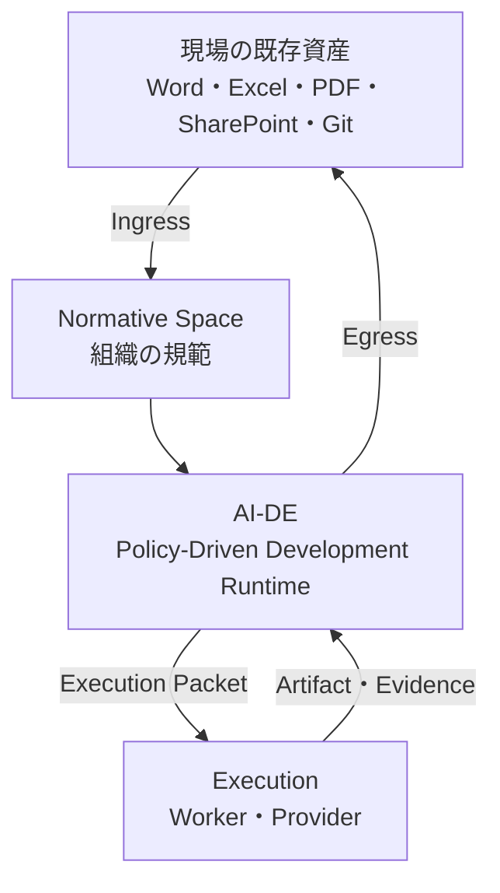
```mermaid
flowchart TB
  ORG["現場の既存資産<br/>Word・Excel・PDF・SharePoint・Git"]
  NORM["Normative Space<br/>組織の規範"]
  AIDE["AI-DE<br/>Policy-Driven Development Runtime"]
  EXEC["Execution<br/>Worker・Provider"]
  ORG -->|Ingress| NORM
  NORM --> AIDE
  AIDE -->|Execution Packet| EXEC
  EXEC -->|Artifact・Evidence| AIDE
  AIDE -->|Egress| ORG
```

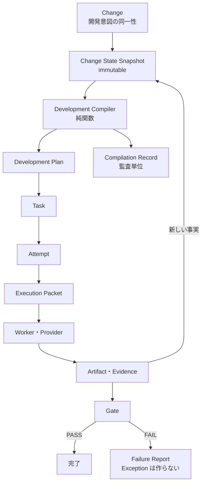
```mermaid
flowchart TB
  CH["Change<br/>開発意図の同一性"] --> SS["Change State Snapshot<br/>immutable"]
  SS --> CMP["Development Compiler<br/>純関数"]
  CMP --> PLAN["Development Plan"]
  CMP --> CR["Compilation Record<br/>監査単位"]
  PLAN --> TASK["Task"]
  TASK --> ATT["Attempt"]
  ATT --> PKT["Execution Packet"]
  PKT --> WK["Worker・Provider"]
  WK --> ART["Artifact・Evidence"]
  ART --> GATE["Gate"]
  GATE -->|PASS| DONE["完了"]
  GATE -->|FAIL| FR["Failure Report<br/>Exception は作らない"]
  ART -->|新しい事実| SS
```

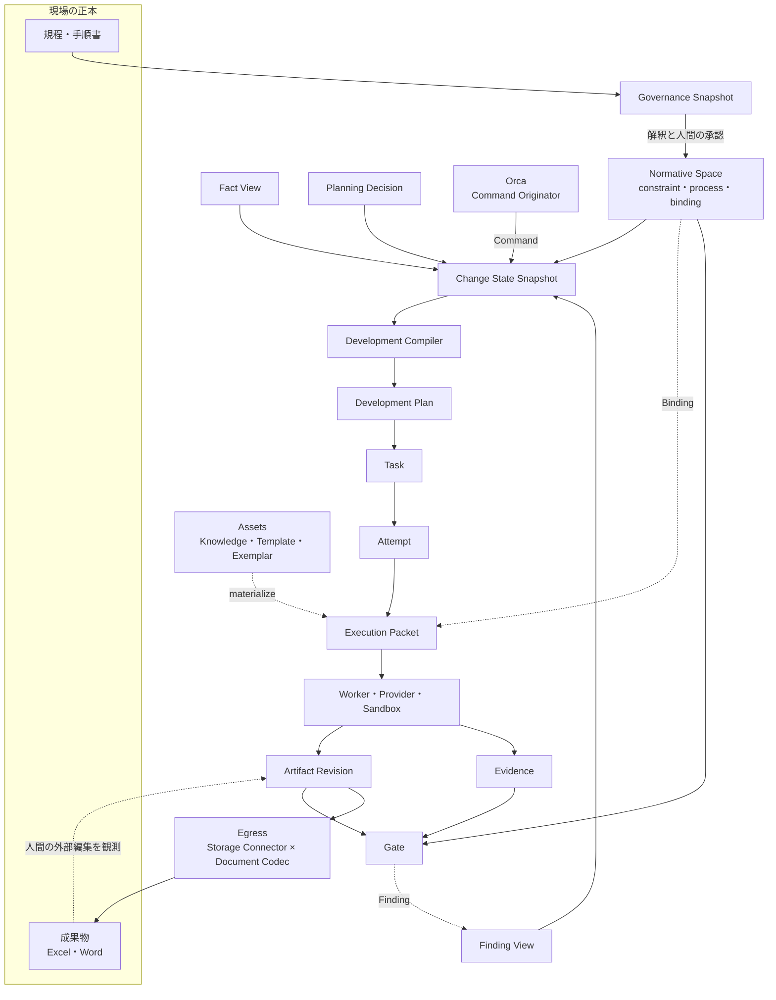
```mermaid
flowchart TB
  subgraph SRC["現場の正本"]
    S1["規程・手順書"]
    S2["成果物<br/>Excel・Word"]
  end
  SNAP["Governance Snapshot"]
  NORM["Normative Space<br/>constraint・process・binding"]
  FACT["Fact View"]
  FIND["Finding View"]
  PD["Planning Decision"]
  SS["Change State Snapshot"]
  CMP["Development Compiler"]
  PLAN["Development Plan"]
  TASK["Task"]
  ATT["Attempt"]
  PKT["Execution Packet"]
  ASSET["Assets<br/>Knowledge・Template・Exemplar"]
  WK["Worker・Provider・Sandbox"]
  ART["Artifact Revision"]
  EVD["Evidence"]
  GATE["Gate"]
  EGR["Egress<br/>Storage Connector × Document Codec"]
  ORCA["Orca<br/>Command Originator"]
  S1 --> SNAP
  SNAP -->|解釈と人間の承認| NORM
  NORM --> SS
  FACT --> SS
  FIND --> SS
  PD --> SS
  SS --> CMP
  CMP --> PLAN
  PLAN --> TASK
  TASK --> ATT
  ATT --> PKT
  PKT --> WK
  ASSET -. materialize .-> PKT
  NORM -. Binding .-> PKT
  WK --> ART
  WK --> EVD
  ART --> GATE
  EVD --> GATE
  NORM --> GATE
  GATE -.->|Finding| FIND
  ART --> EGR
  EGR --> S2
  S2 -.->|人間の外部編集を観測| ART
  ORCA -->|Command| SS
```

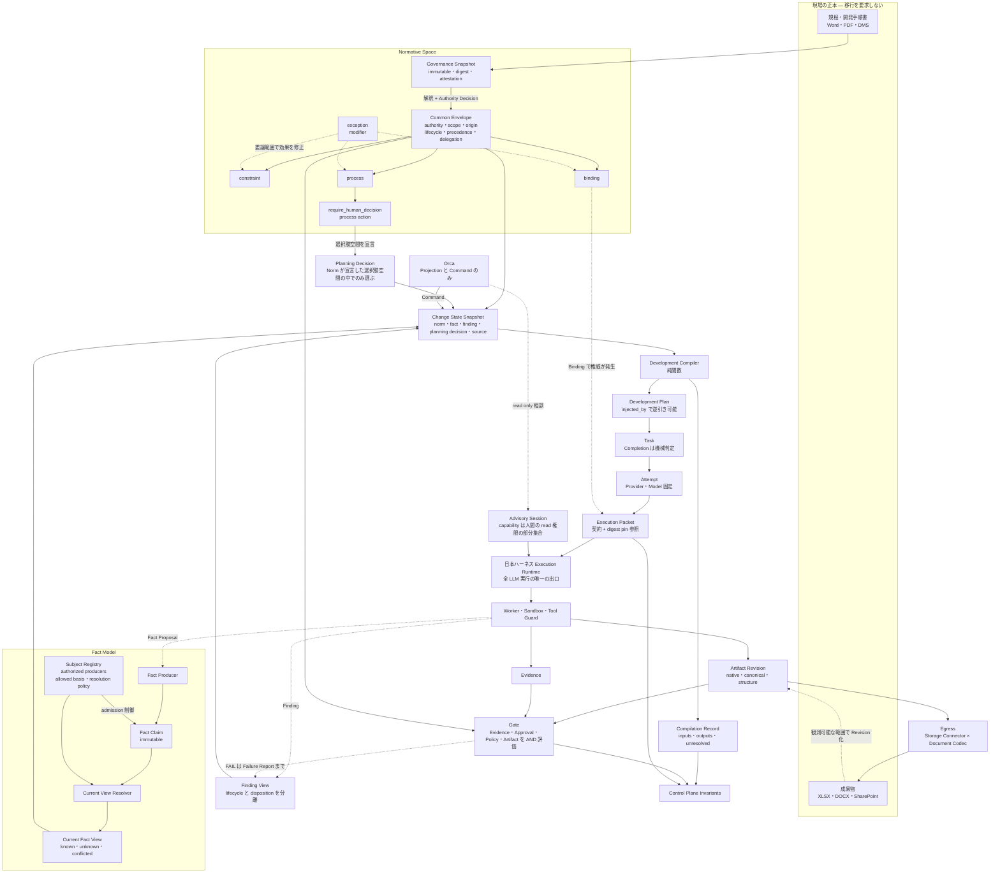
```mermaid
flowchart TB
  subgraph ORG["現場の正本 — 移行を要求しない"]
    S1["規程・開発手順書<br/>Word・PDF・DMS"]
    S2["成果物<br/>XLSX・DOCX・SharePoint"]
  end
  subgraph NRM["Normative Space"]
    SNAP["Governance Snapshot<br/>immutable・digest・attestation"]
    ENV["Common Envelope<br/>authority・scope・origin<br/>lifecycle・precedence・delegation"]
    K1["constraint"]
    K2["process"]
    K3["binding"]
    MOD["exception<br/>modifier"]
    ACT["require_human_decision<br/>process action"]
  end
  subgraph FCT["Fact Model"]
    PRD["Fact Producer"]
    CLM["Fact Claim<br/>immutable"]
    REG["Subject Registry<br/>authorized producers<br/>allowed basis・resolution policy"]
    RSV["Current View Resolver"]
    VW["Current Fact View<br/>known・unknown・conflicted"]
  end
  FIND["Finding View<br/>lifecycle と disposition を分離"]
  PD["Planning Decision<br/>Norm が宣言した選択肢空間の中でのみ選ぶ"]
  SS["Change State Snapshot<br/>norm・fact・finding・planning decision・source"]
  CMP["Development Compiler<br/>純関数"]
  CR["Compilation Record<br/>inputs・outputs・unresolved"]
  PLAN["Development Plan<br/>injected_by で逆引き可能"]
  TASK["Task<br/>Completion は機械判定"]
  ATT["Attempt<br/>Provider・Model 固定"]
  PKT["Execution Packet<br/>契約 + digest pin 参照"]
  ADV["Advisory Session<br/>capability は人間の read 権限の部分集合"]
  RT["日本ハーネス Execution Runtime<br/>全 LLM 実行の唯一の出口"]
  WK["Worker・Sandbox・Tool Guard"]
  ART["Artifact Revision<br/>native・canonical・structure"]
  EVD["Evidence"]
  GATE["Gate<br/>Evidence・Approval・Policy・Artifact を AND 評価"]
  EGR["Egress<br/>Storage Connector × Document Codec"]
  INV["Control Plane Invariants"]
  ORCA["Orca<br/>Projection と Command のみ"]
  S1 --> SNAP
  SNAP -->|解釈 + Authority Decision| ENV
  ENV --> K1
  ENV --> K2
  ENV --> K3
  MOD -. 委譲範囲で効果を修正 .-> K1
  MOD -.-> K2
  MOD -.-> K3
  K2 --> ACT
  ACT -->|選択肢空間を宣言| PD
  PRD --> CLM
  REG -->|admission 制御| CLM
  CLM --> RSV
  REG --> RSV
  RSV --> VW
  ENV --> SS
  VW --> SS
  FIND --> SS
  PD --> SS
  SS --> CMP
  CMP --> PLAN
  CMP --> CR
  PLAN --> TASK
  TASK --> ATT
  ATT --> PKT
  K3 -. Binding で権威が発生 .-> PKT
  PKT --> RT
  ADV --> RT
  RT --> WK
  WK --> ART
  WK --> EVD
  WK -.->|Fact Proposal| PRD
  WK -.->|Finding| FIND
  ART --> GATE
  EVD --> GATE
  ENV --> GATE
  GATE -.->|FAIL は Failure Report まで| FIND
  ART --> EGR
  EGR --> S2
  S2 -.->|観測可能な範囲で Revision 化| ART
  ORCA -->|Command| SS
  ORCA -.->|read only 相談| ADV
  CR --> INV
  GATE --> INV
  PKT --> INV
```

L4 の点線は「参照・提案・観測」を表し、実線は「Authority を伴う流れ」を表す。Agent 側から Norm へ向かう実線が存在しないことが Authority Conservation の可視化になっている。

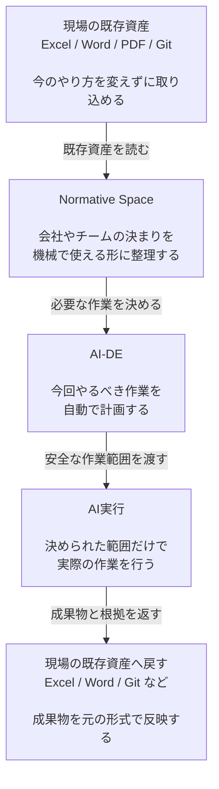
```mermaid
flowchart TB
  A["現場の既存資産<br/>Excel / Word / PDF / Git<br/><br/>今のやり方を変えずに取り込める"]
  B["Normative Space<br/><br/>会社やチームの決まりを<br/>機械で使える形に整理する"]
  C["AI-DE<br/><br/>今回やるべき作業を<br/>自動で計画する"]
  D["AI実行<br/><br/>決められた範囲だけで<br/>実際の作業を行う"]
  E["現場の既存資産へ戻す<br/>Excel / Word / Git など<br/><br/>成果物を元の形式で反映する"]
  A -->|"既存資産を読む"| B
  B -->|"必要な作業を決める"| C
  C -->|"安全な作業範囲を渡す"| D
  D -->|"成果物と根拠を返す"| E
```

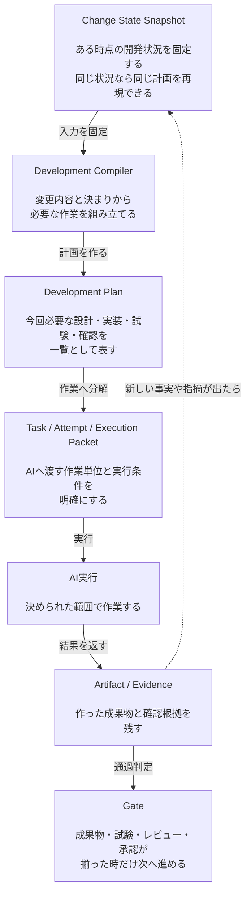
```mermaid
flowchart TB
  A["Change State Snapshot<br/><br/>ある時点の開発状況を固定する<br/>同じ状況なら同じ計画を再現できる"]
  B["Development Compiler<br/><br/>変更内容と決まりから<br/>必要な作業を組み立てる"]
  C["Development Plan<br/><br/>今回必要な設計・実装・試験・確認を<br/>一覧として表す"]
  D["Task / Attempt / Execution Packet<br/><br/>AIへ渡す作業単位と実行条件を<br/>明確にする"]
  E["AI実行<br/><br/>決められた範囲で作業する"]
  F["Gate<br/><br/>成果物・試験・レビュー・承認が<br/>揃った時だけ次へ進める"]
  G["Artifact / Evidence<br/><br/>作った成果物と確認根拠を残す"]
  A -->|"入力を固定"| B -->|"計画を作る"| C -->|"作業へ分解"| D -->|"実行"| E
  E -->|"結果を返す"| G -->|"通過判定"| F
  G -. "新しい事実や指摘が出たら" .-> A
```

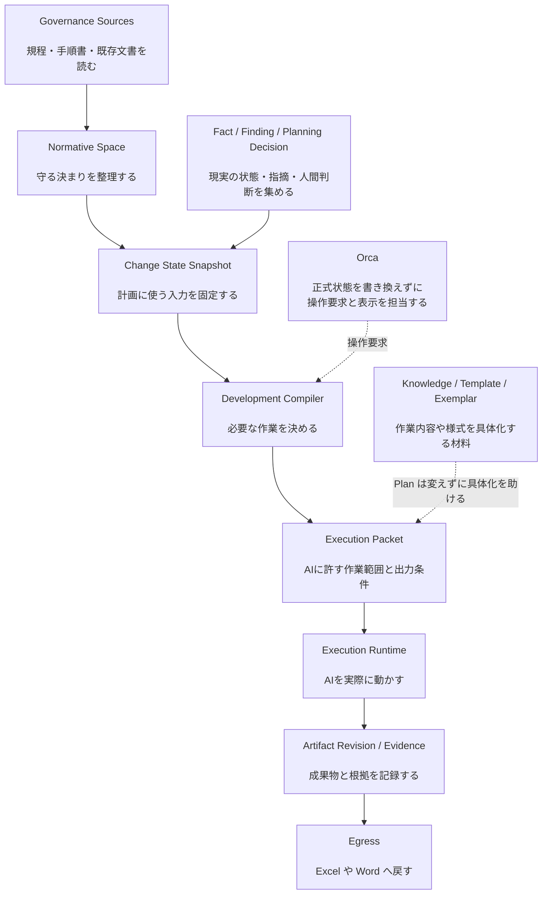
```mermaid
flowchart TB
  S["Governance Sources<br/><br/>規程・手順書・既存文書を読む"]
  N["Normative Space<br/><br/>守る決まりを整理する"]
  F["Fact / Finding / Planning Decision<br/><br/>現実の状態・指摘・人間判断を集める"]
  P["Change State Snapshot<br/><br/>計画に使う入力を固定する"]
  C["Development Compiler<br/><br/>必要な作業を決める"]
  K["Knowledge / Template / Exemplar<br/><br/>作業内容や様式を具体化する材料"]
  X["Execution Packet<br/><br/>AIに許す作業範囲と出力条件"]
  R["Execution Runtime<br/><br/>AIを実際に動かす"]
  A["Artifact Revision / Evidence<br/><br/>成果物と根拠を記録する"]
  E["Egress<br/><br/>Excel や Word へ戻す"]
  O["Orca<br/><br/>正式状態を書き換えずに<br/>操作要求と表示を担当する"]
  S --> N
  N --> P
  F --> P
  P --> C --> X --> R --> A --> E
  K -. "Plan は変えずに具体化を助ける" .-> X
  O -. "操作要求" .-> C
```

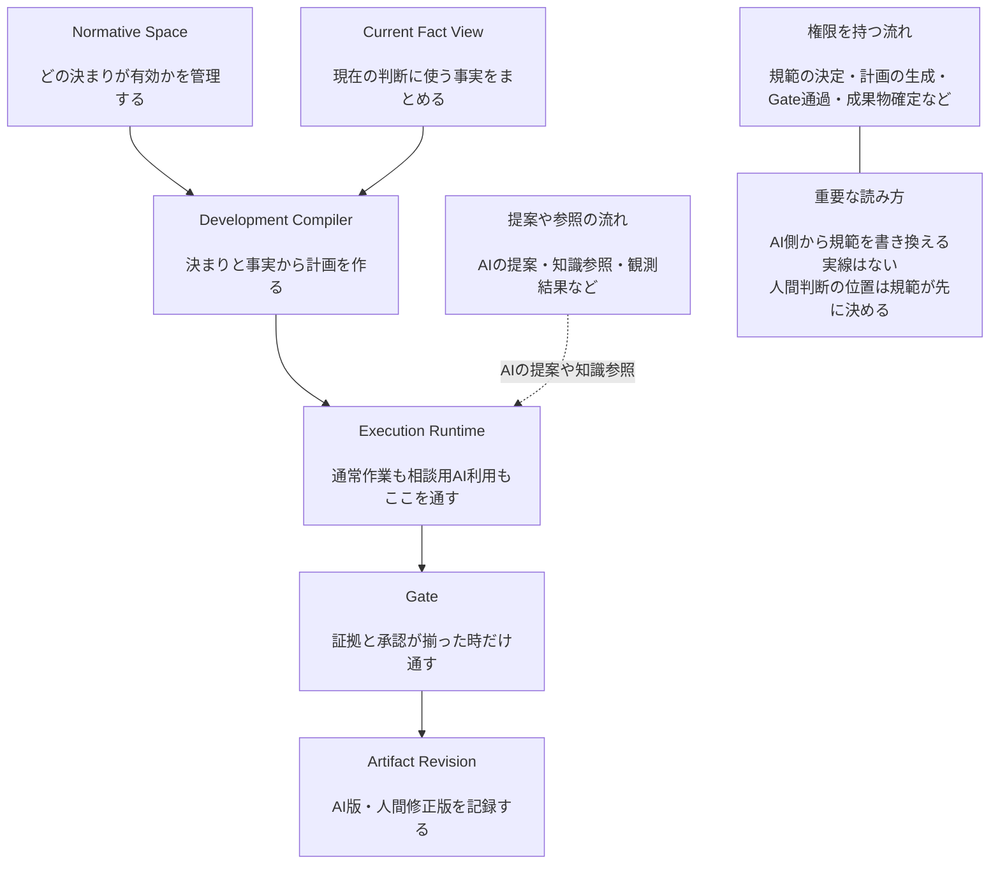
```mermaid
flowchart TB
  A["権限を持つ流れ<br/><br/>規範の決定・計画の生成・<br/>Gate通過・成果物確定など"]
  B["提案や参照の流れ<br/><br/>AIの提案・知識参照・観測結果など"]
  C["Normative Space<br/><br/>どの決まりが有効かを管理する"]
  D["Current Fact View<br/><br/>現在の判断に使う事実をまとめる"]
  E["Development Compiler<br/><br/>決まりと事実から計画を作る"]
  F["Execution Runtime<br/><br/>通常作業も相談用AI利用も<br/>ここを通す"]
  G["Gate<br/><br/>証拠と承認が揃った時だけ通す"]
  H["Artifact Revision<br/><br/>AI版・人間修正版を記録する"]
  I["重要な読み方<br/><br/>AI側から規範を書き換える実線はない<br/>人間判断の位置は規範が先に決める"]
  C --> E
  D --> E
  E --> F --> G --> H
  B -. "AIの提案や知識参照" .-> F
  A --- I
```

### 図2. Normative Effect Model（§4 の可視化）

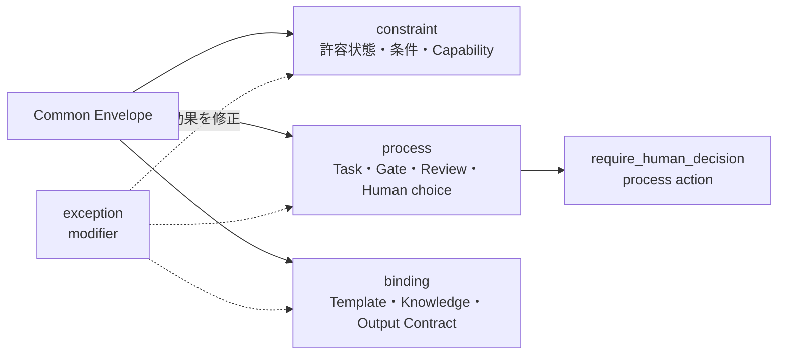
```mermaid
flowchart LR
  ENV["Common Envelope"]
  K1["constraint<br/>許容状態・条件・Capability"]
  K2["process<br/>Task・Gate・Review・Human choice"]
  K3["binding<br/>Template・Knowledge・Output Contract"]
  MOD["exception<br/>modifier"]
  ACT["require_human_decision<br/>process action"]
  ENV --> K1
  ENV --> K2
  ENV --> K3
  MOD -. 効果を修正 .-> K1
  MOD -.-> K2
  MOD -.-> K3
  K2 --> ACT
```

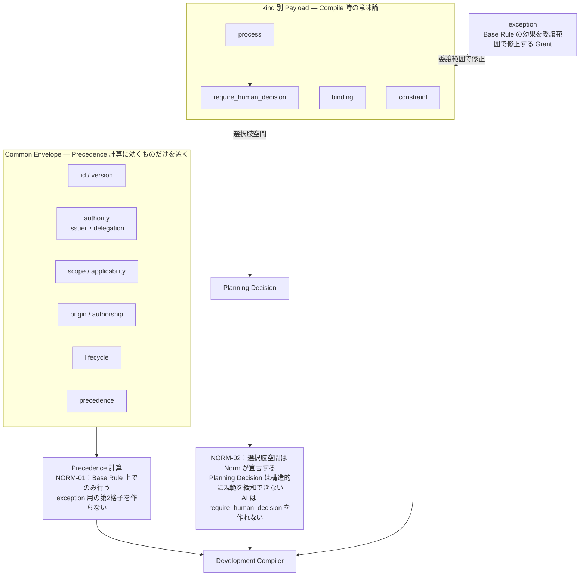
```mermaid
flowchart TB
  subgraph EV["Common Envelope — Precedence 計算に効くものだけを置く"]
    F1["id / version"]
    F2["authority<br/>issuer・delegation"]
    F3["scope / applicability"]
    F4["origin / authorship"]
    F5["lifecycle"]
    F6["precedence"]
  end
  subgraph PL["kind 別 Payload — Compile 時の意味論"]
    K1["constraint"]
    K2["process"]
    K3["binding"]
    ACT["require_human_decision"]
    K2 --> ACT
  end
  MOD["exception<br/>Base Rule の効果を委譲範囲で修正する Grant"]
  PREC["Precedence 計算<br/>NORM-01：Base Rule 上でのみ行う<br/>exception 用の第2格子を作らない"]
  PD["Planning Decision"]
  NOREL["NORM-02：選択肢空間は Norm が宣言する<br/>Planning Decision は構造的に規範を緩和できない<br/>AI は require_human_decision を作れない"]
  EV --> PREC
  PL --> COMP["Development Compiler"]
  MOD -. 委譲範囲で修正 .-> PL
  PREC --> COMP
  ACT -->|選択肢空間| PD
  PD --> NOREL
  NOREL --> COMP
```

メタ規範（規範を変える権限に関する規範）は constraint の「Capability を制約」に収まるため、第4の kind を必要としない。

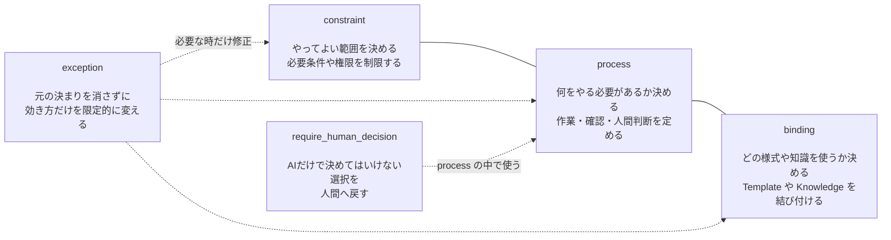
```mermaid
flowchart LR
  C["constraint<br/><br/>やってよい範囲を決める<br/>必要条件や権限を制限する"]
  P["process<br/><br/>何をやる必要があるか決める<br/>作業・確認・人間判断を定める"]
  B["binding<br/><br/>どの様式や知識を使うか決める<br/>Template や Knowledge を結び付ける"]
  X["exception<br/><br/>元の決まりを消さずに<br/>効き方だけを限定的に変える"]
  H["require_human_decision<br/><br/>AIだけで決めてはいけない選択を<br/>人間へ戻す"]
  C --- P --- B
  X -. "必要な時だけ修正" .-> C
  X -.-> P
  X -.-> B
  H -. "process の中で使う" .-> P
```

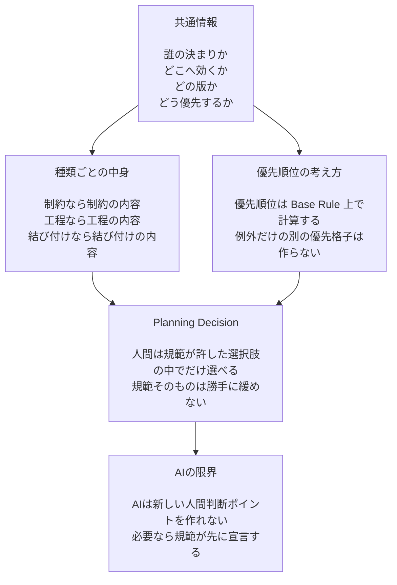
```mermaid
flowchart TB
  E["共通情報<br/><br/>誰の決まりか<br/>どこへ効くか<br/>どの版か<br/>どう優先するか"]
  K["種類ごとの中身<br/><br/>制約なら制約の内容<br/>工程なら工程の内容<br/>結び付けなら結び付けの内容"]
  P["優先順位の考え方<br/><br/>優先順位は Base Rule 上で計算する<br/>例外だけの別の優先格子は作らない"]
  D["Planning Decision<br/><br/>人間は規範が許した選択肢の中でだけ選べる<br/>規範そのものは勝手に緩めない"]
  A["AIの限界<br/><br/>AIは新しい人間判断ポイントを作れない<br/>必要なら規範が先に宣言する"]
  E --> K
  E --> P
  K --> D
  P --> D
  D --> A
```

### 図3. Fact Model（§5 の可視化）

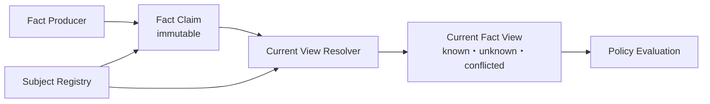
```mermaid
flowchart LR
  PR["Fact Producer"] --> CL["Fact Claim<br/>immutable"]
  REG["Subject Registry"] --> CL
  CL --> RS["Current View Resolver"]
  REG --> RS
  RS --> VW["Current Fact View<br/>known・unknown・conflicted"]
  VW --> PE["Policy Evaluation"]
```

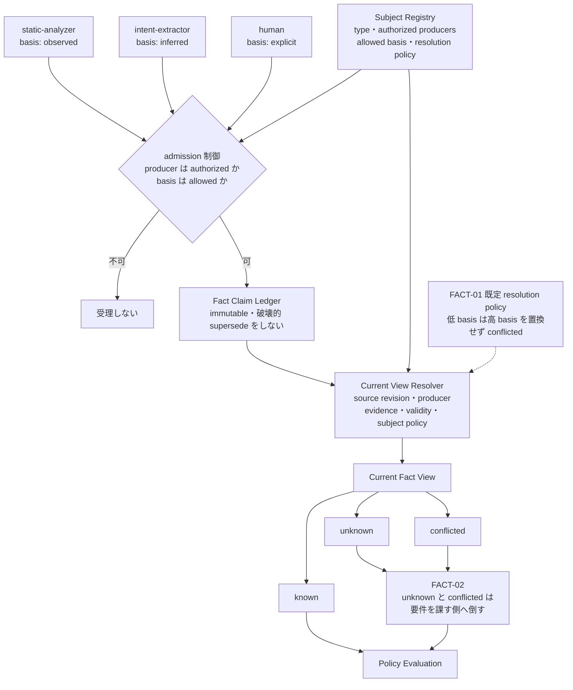
```mermaid
flowchart TB
  P1["static-analyzer<br/>basis: observed"]
  P2["intent-extractor<br/>basis: inferred"]
  P3["human<br/>basis: explicit"]
  REG["Subject Registry<br/>type・authorized producers<br/>allowed basis・resolution policy"]
  ADM{"admission 制御<br/>producer は authorized か<br/>basis は allowed か"}
  REJ["受理しない"]
  LED["Fact Claim Ledger<br/>immutable・破壊的 supersede をしない"]
  RSV["Current View Resolver<br/>source revision・producer<br/>evidence・validity・subject policy"]
  DEF["FACT-01 既定 resolution policy<br/>低 basis は高 basis を置換せず conflicted"]
  VW["Current Fact View"]
  ST1["known"]
  ST2["unknown"]
  ST3["conflicted"]
  PE["Policy Evaluation"]
  SAFE["FACT-02<br/>unknown と conflicted は<br/>要件を課す側へ倒す"]
  P1 --> ADM
  P2 --> ADM
  P3 --> ADM
  REG --> ADM
  ADM -->|不可| REJ
  ADM -->|可| LED
  LED --> RSV
  REG --> RSV
  DEF -.-> RSV
  RSV --> VW
  VW --> ST1
  VW --> ST2
  VW --> ST3
  ST1 --> PE
  ST2 --> SAFE
  ST3 --> SAFE
  SAFE --> PE
```

I-22r が廃止できた理由。inferred な producer は subject 単位の admission 制御で弾かれるため、全 subject 共通の basis 全順序は不要になる。I-22r の意図は FACT-01 の既定 policy として保存されている。

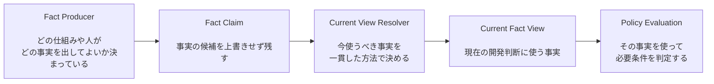
```mermaid
flowchart LR
  P["Fact Producer<br/><br/>どの仕組みや人が<br/>どの事実を出してよいか決まっている"]
  C["Fact Claim<br/><br/>事実の候補を上書きせず残す"]
  R["Current View Resolver<br/><br/>今使うべき事実を<br/>一貫した方法で決める"]
  V["Current Fact View<br/><br/>現在の開発判断に使う事実"]
  G["Policy Evaluation<br/><br/>その事実を使って<br/>必要条件を判定する"]
  P --> C --> R --> V --> G
```

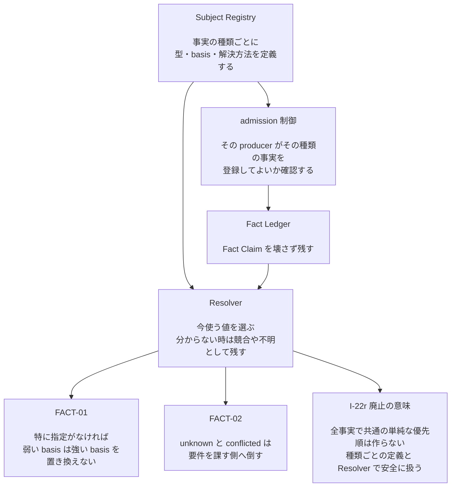
```mermaid
flowchart TB
  A["admission 制御<br/><br/>その producer がその種類の事実を<br/>登録してよいか確認する"]
  B["Subject Registry<br/><br/>事実の種類ごとに<br/>型・basis・解決方法を定義する"]
  C["Fact Ledger<br/><br/>Fact Claim を壊さず残す"]
  D["Resolver<br/><br/>今使う値を選ぶ<br/>分からない時は競合や不明として残す"]
  E["FACT-01<br/><br/>特に指定がなければ<br/>弱い basis は強い basis を置き換えない"]
  F["FACT-02<br/><br/>unknown と conflicted は<br/>要件を課す側へ倒す"]
  G["I-22r 廃止の意味<br/><br/>全事実で共通の単純な優先順は作らない<br/>種類ごとの定義と Resolver で安全に扱う"]
  A --> C
  B --> A
  B --> D
  C --> D
  D --> E
  D --> F
  D --> G
```

**実装向け**
 実装担当が「どの部品を作るのか」「どこで責務を切るのか」を確認するための図です。
 見るべき順番は **部品分割 → 1件の処理の流れ → 外部連携** です。

**最初に押さえること** 

- 正式な判断を持つのは AI-DE 側 
- AI 実行は実行系、計画生成は制御系 
- Excel / Word 連携は別部品で吸収する

**実装の切り分け** 

- 制御系：規範、事実、計画、Gate 
- 実行系：Task、Attempt、Packet、Runtime 
- 連携系：保存先連携、文書形式連携、知識参照

### 実装向け図1. どの部品を作るか

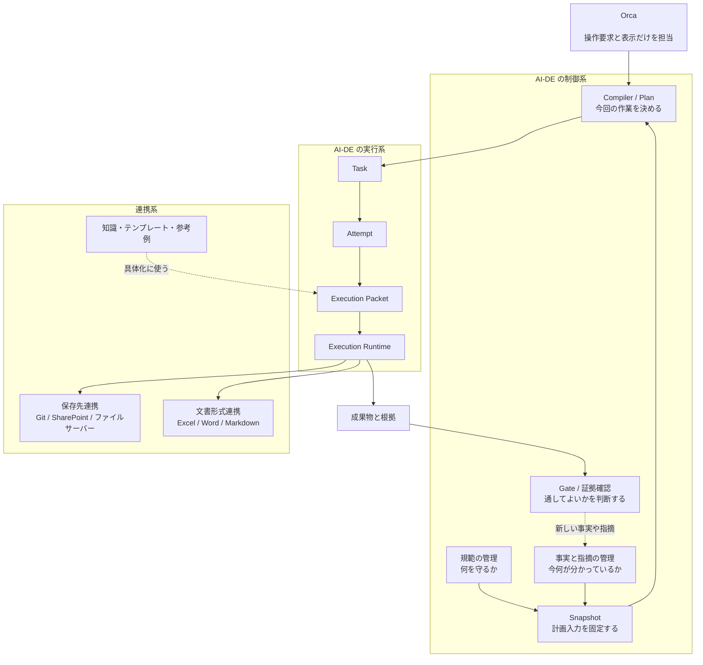
```mermaid
flowchart TB
  O["Orca<br/><br/>操作要求と表示だけを担当"]
  subgraph C["AI-DE の制御系"]
    N["規範の管理<br/>何を守るか"]
    F["事実と指摘の管理<br/>今何が分かっているか"]
    S["Snapshot<br/>計画入力を固定する"]
    P["Compiler / Plan<br/>今回の作業を決める"]
    G["Gate / 証拠確認<br/>通してよいかを判断する"]
  end
  subgraph X["AI-DE の実行系"]
    T["Task"]
    A["Attempt"]
    K["Execution Packet"]
    R["Execution Runtime"]
  end
  subgraph L["連携系"]
    D["知識・テンプレート・参考例"]
    SC["保存先連携<br/>Git / SharePoint / ファイルサーバー"]
    DC["文書形式連携<br/>Excel / Word / Markdown"]
  end
  AR["成果物と根拠"]
  O --> P
  N --> S
  F --> S
  S --> P --> T --> A --> K --> R --> AR --> G
  D -. "具体化に使う" .-> K
  R --> SC
  R --> DC
  G -. "新しい事実や指摘" .-> F
```

ここで一番大事なのは、**計画を決める場所と、AIを動かす場所を分ける**ことです。

### 実装向け図2. 1件の処理でどこを通るか

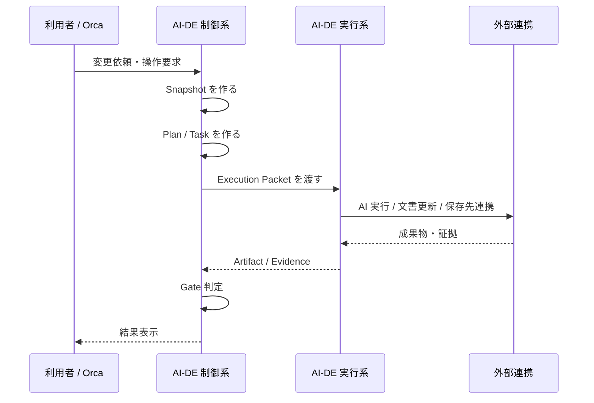
```mermaid
sequenceDiagram
  participant U as 利用者 / Orca
  participant C as AI-DE 制御系
  participant E as AI-DE 実行系
  participant X as 外部連携
  U->>C: 変更依頼・操作要求
  C->>C: Snapshot を作る
  C->>C: Plan / Task を作る
  C->>E: Execution Packet を渡す
  E->>X: AI 実行 / 文書更新 / 保存先連携
  X-->>E: 成果物・証拠
  E-->>C: Artifact / Evidence
  C->>C: Gate 判定
  C-->>U: 結果表示
```

実装時は、**外部に出すのは Packet、戻すのは Artifact / Evidence** という往復を意識すると整理しやすくなります。

**商売向け**
 お客さんや社内説明で、「この仕組みを入れると何が良くなるのか」を伝えるための図です。
 技術名よりも、**既存資産を活かせる / やり方を再現できる / 証跡が残る** を中心に見せます。

**伝える価値** 

- 今のExcelやWordを捨てなくてよい 
- チームごとのやり方を AI が再現できる 
- 品質確認の根拠を残せる

**向いている説明相手** 

- 部門責任者 
- 現場導入を検討するお客さん 
- 営業・提案書を作る人

### 商売向け図1. 現状の悩みと導入後

```mermaid
flowchart LR
  subgraph P["よくある悩み"]
    P1["資料が散らばっている"]
    P2["チームごとにやり方が違う"]
    P3["テストや確認が漏れやすい"]
    P4["なぜそうしたか説明しづらい"]
  end
  NH["日本ハーネス<br/><br/>既存資産を読み込み<br/>チームのやり方に沿って<br/>AI を動かす"]
  subgraph V["導入後にできること"]
    V1["既存の Excel / Word をそのまま使える"]
    V2["必要な作業を自動で選べる"]
    V3["成果物と確認根拠を残せる"]
    V4["人依存を減らして引き継ぎしやすい"]
  end
  P --> NH --> V
```

売りは「新しい管理方式へ全部乗せ換えること」ではなく、**今ある資産を活かしたまま AI を導入できること**です。

### 商売向け図2. 導入イメージ

```mermaid
flowchart TB
  A["既存環境<br/>SharePoint / Git / ファイルサーバー / Excel / Word"]
  B["日本ハーネス<br/>決まりを読み、必要な作業を決め、AIを統制する"]
  C["導入効果<br/>手順の再現 / 品質の安定 / 説明可能性"]
  A -->|"そのまま接続"| B -->|"結果を戻す"| A
  B --> C
```

お客さんに見せるときは、**置き換えではなく接続**、**自動化だけでなく統制** を強調すると伝わりやすいです。

## 補助. 開発者向けキャッチアップ

**この節は補助資料であり、仕様・Decisionではない。**
新規参画者が短時間で全体像を掴むための読み方を示す。本文と食い違う場合は、必ず本文のDecisionを優先する。

### 最短キャッチアップ導線

**10分：全体像**L1 / L2 の図 → §1 原則 → §2-1 追加凍結事項。「日本ハーネス / AI-DE / Execution / Artifact」の責務境界だけ掴む。

**30分：実装に必要な概念**L3 / L4 → §4 Normative Effect Model → §5 Fact Model。Norm / Fact / Planning Decision / Gate の関係を理解する。

**実装開始前：自分の担当だけ深掘り**§6 Phase 1成功条件を確認し、担当領域に対応するDecision IDだけを読み直す。過去v0.xは「なぜ？」が出たときだけ参照。

### 担当別の読む場所

**AI-DE / Control Plane担当**

COMPILE-001 / FINAL-COMPILE-01 / §4 / §5 / GATE-001 を優先。

**Execution Runtime / Agent担当**

EXEC-001 / FINAL-EXEC-01 / FINAL-EXEC-02 / Execution Packet / capability境界を優先。

**Artifact / Document担当**

ARTIFACT-001/002 / FINAL-ARTIFACT-01 / Egress / Storage Connector × Document Codec を優先。

**Orca / UI担当**

OrcaはProjection / Command Originator。Authoritative State Transitionを持たない、という境界を最優先で確認。

### 参画完了の目安

- Human / AI / Policy / Code の責務を自分の言葉で説明できる。 
- 同じChange State Snapshotから同じPlanになる理由を説明できる。 
- FactとFinding、Normative DecisionとPlanning Decisionの違いを説明できる。 
- AIが直接Rule / Gate / Authoritative Factを書き換えられない理由を説明できる。 
- TeamのExcel / Wordを統一形式へ移行させずに扱う理由を説明できる。 

### 文脈用語集

本文中の点線下線付き英語にカーソルを当てると、このプロジェクトでの意味が表示される。Tabキーでフォーカスしても表示可能。

**推奨運用：**新規メンバーに過去の全議論を読ませない。まず本v1.0と担当領域だけを読み、実装Issueには必ず関連Decision IDを付ける。「なぜこの制約があるのか」が必要になった時だけv0.xへ遡る。

## 1. 変更しない設計原則

**PRINCIPLE-001**

```text
HUMAN  = 本当に必要な意思決定
AI     = 意味理解・設計・実装・意味レビュー
POLICY = 何を要求するか
CODE   = 一意に決定できる処理
```

**PRINCIPLE-002**

Authority Conservation。委譲された以上のAuthorityを持たせない。

**PRINCIPLE-003**

Evidence over Assertion。証明できないことを証明済みと扱わない。

**PRINCIPLE-004**

Adapt, Don't Impose。現場のWord / Excel / DMS / Team手順に基盤側が適応する。

**PRINCIPLE-005**

ConversationをSSOTにしない。

**PRINCIPLE-006**

Planは決定的、Executionは非決定性を許容して記録する。

**PRINCIPLE-007**

Provider / Modelの都合をPlanへ漏らさない。

**PRINCIPLE-008**

AI-DEを便利機能の巨大集合にしない。

## 2. v1.0へ持っていく凍結事項

**凍結済み。再議論しない。**変更は §8 の変更手続きに従う。最終裁定において、以下 22 項目に Fatal contradiction は検出されなかった。

| ID | 凍結する判断 |
| --- | --- |
| **ARCH-001** | 日本ハーネスは上位Ecosystem。AI-DE / Orca / STK / Document・Artifact連携等を包含する。 |
| **AIDE-001** | AI-DE = Policy-Driven Development Runtime。North Star = Conformance。 |
| **AIDE-002** | Development Compilerは非決定的Asset検索を入力にしない。Asset materializationはExecution側。 |
| **ASSET-001** | Assetはinert。Knowledge / Template等のAuthorityはGovernance Bindingから生じる。 |
| **STK-001** | STK = What to test。Team Playbook = When / Required。Template = How to format。Exemplar = 実例。 |
| **RECORD-001** | FactとFindingを分離する。AIの意味評価をReality SSOTへ直接入れない。 |
| **COMPILE-001** | CompileはimmutableなChange State Snapshotを読み、同じSnapshotから同じPlanを返す。 |
| **TASK-001/002** | Task / Attemptを分離し、Task Completion / Artifact Acceptanceも分離する。 |
| **EXEC-001** | Provider / SubagentはExecution detail。親のPermission / Artifact ownership / Output Contractを超えない。 |
| **GATE-001** | Gate overrideを作らない。緩和は正式なGovernance / Exception経路を通し、Gateを再評価する。 |
| **ARTIFACT-001/002** | EgressまでAdaptする。人間の外部編集は禁止せず、観測可能な範囲でRevision化する。 |
| **KNOWLEDGE-001** | required Knowledgeは決定的、advisory KnowledgeはExecution側の非決定性として記録する。 |

### 2-1. 議論を経て凍結する追加方向

| ID | 最終方向 |
| --- | --- |
| **FINAL-AUTH-01** | 事前にRule / Authority Decisionで承認された条件をCodeが発火させることは、新しいDecisionではなく**執行**。結果は根拠Rule revision / DecisionへTrace可能。 |
| **FINAL-RECORD-01** | Findingは**観測上のlifecycle**と**人間のdisposition**を分離し、`accepted`というGate bypassを誘発するstatusを持たない。具体enumは実装時。 |
| **FINAL-GATE-01** | Risk Acceptanceが**実際のGovernance要求を緩和する場合**だけExceptionが必要。Planning relevanceだけではException要否を決めない。 |
| **FINAL-EXEC-01** | Advisory AIはAI-DE Coreの責務にしない。日本ハーネス共通Execution境界からProviderを呼ぶ。Advisory→Attemptは同じ権限を昇格せず、新しいExecution Packet / capabilityを取得する。 |
| **FINAL-EXEC-02** | Conversation transcriptはPacket入力でも自動Evidenceでもない。Audit / Provenance用途。Evidence化は将来のEvidence Contractに従う。 |
| **FINAL-CONTRACT-01** | ContractはSeamから始め、Compatibility Obligationが発生した境界だけCandidate / Stableへ成熟させる。実装数だけで成熟度を決めない。 |
| **FINAL-RULE-01** | Normの**origin / authorship / authority**を分離する。Rule変更のAuthoring / Amendment / Exception / Repealをモデル外操作にしない。 |
| **FINAL-ARTIFACT-01** | 観測できない期間・範囲について「外部変更がなかった」と主張しない。Connectorのstatic capabilityだけでなく実際のObservation coverageをEvidenceとして扱う。 |
| **FINAL-COMPILE-01** | Normative Spaceを変えずPlanを変える**Planning Authority Decision**は存在するため、Change State SnapshotでNormative Stateとは分離して扱う。 |
| **FINAL-TASK-01** | Phase 1ではAIの裁量的Task再分割をPlanへ昇格させない。AIはAttempt内部Sub-stepを自由に分解できる。新Factで既存Ruleの展開数が変わる場合は通常Recompile。 |

## 3. Phase 1を止めないため後送する事項

以下は「未解決」ではなく**Deferred**。v1.0設計Freezeのブロッカーにしない。

| 項目 | 後送理由 |
| --- | --- |
| Advisory Sessionの詳細Schema / token形式 | Phase 1のPDDR縦切りに不要。Data egress policy + mode-bound capabilityという原則だけ保持。 |
| Impact Previewのthreshold / UI項目 | 実測して決める。Authorityそのものはissuer delegationから得る。Impactは追加escalation材料。 |
| Rule変更時の具体Approval Matrix | Issuer / delegation model確定後に実装で詰める。Draft自体はCompile入力にしない。 |
| Artifact Observation Coverageの具体Schema | Phase 1は観測可能なGit / File System系Connectorで縦切りする。 |
| Contract一覧（6本 / 8本） | 実装から抽出する。境界だけ保持し、空のContractを先に凍結しない。 |
| AIによるPlan-level Task decomposition | Phase 2以降。Phase 1はSub-stepで十分。 |
| Conversation Evidence昇格 | Evidence Contractが必要になる時点まで実装しない。 |
| Subject Registry の具体的な subject 名前空間 | FINAL-OPEN-02 裁定の実装詳細。Producer の may_assert と同時に決める。 |
| subject 個別の resolution policy の中身 | 既定（FACT-01）で開始し、必要な subject から個別に定義する。 |
| constraint / process / binding の payload 詳細スキーマ | Envelope と kind 分類は §4 で確定済み。payload は実装時。 |
| Impact Preview unknownの詳細運用 | unknownを0と扱わない。tighteningでも無条件安全扱いしない、まででFreeze。 |

## 4. Normative Effect Model（確定）

**FINAL-OPEN-01 裁定：v0.6 推奨案を採用。**Phase 1 の Normative Space で表現できない具体例は検出されなかった。kind を増やす提案・減らす提案ともに受け付けない。

### 4-1. 確定モデル

```text
Common Envelope
  id / version
  authority
  scope / applicability
  origin / authorship
  lifecycle
  precedence / delegation

Base kinds （この3つで固定）
  constraint  : 許容状態・条件・Capability を制約
  process     : Task / Gate / Review / Human choice 等の工程要求を規定
  binding     : Template / Knowledge / Output Contract 等の Asset を規範的に束縛

Modifier
  exception   : 独立 kind ではなく、委譲された範囲で Base Rule の効果を修正する Grant

Process action
  require_human_decision : decision_point を独立 kind にせず、process の要求として表現
```

### 4-2. 表現可能性の確認（裁定根拠）

| Phase 1 で必要な規範 | 帰属 |
| --- | --- |
| payment_data のとき Security Review 必須 | process |
| 承認者は2名以上 | constraint |
| 詳細設計は template v4 準拠 | binding（Output Contract） |
| この Phase で knowledge://x を必須 | binding |
| **enforced Rule の改廃は issuer_owner 承認** | constraint（Capability の制約） |
| **Exemplar への Normative Binding 禁止** | constraint（Capability の制約） |
| UNKNOWN 述語を許容するか | process（Gate 定義） |
| SEC-014 をこの Change で免除 | exception（modifier） |
| 移行方式を人間が選ぶ | process action（require_human_decision） |

**constraint の定義に「Capability を制約」が含まれていることが要点。**メタ規範（規範を変える権限に関する規範）が第4の kind を必要としないのはこの一語による。削らないこと。

### 4-3. モデルの2つの帰結（実装が従うこと）

NORM-01確定Precedence は Base Rule 上でのみ計算する

exception は modifier であるため、precedence は常に base rule 上で計算し、その効果を委譲範囲内で修正する。**exception 用の第2の precedence 格子を作らない。**これにより Authority Conservation が単一の格子で閉じる。

NORM-02確定選択肢の空間は Norm が宣言する

`require_human_decision` の選択肢空間は Norm 側が宣言し、Planning Decision はその中からしか選べない。したがって **Planning Decision は構造的に規範を緩和できない。**

これが I-26（Phase / Gate ID 集合の事後比較）を不採用にしてよい理由である。事後検査で捕まえるのではなく、選択肢空間を規範が持つことで緩和がそもそも表現できない。事後検査より強い保証であるため、I-26 の不採用は正しい。

**あわせて次を保証する。**AI は `require_human_decision` を作れない。作れるのは Governance だけである。AI が迷ったことは Norm を変えないため、決定要求は発生しない。Human Decision Requirement が material trade-off に限定されるのは運用規律ではなく、モデルの構造から出ている。

## 5. Fact Model（確定）

**FINAL-OPEN-02 裁定：Fact Claim + Current Fact View Resolver を採用。最小修正2点を加える。I-22r は廃止**

### 5-1. 確定モデル

```text
Fact Claim (immutable)
  subject / value / producer / basis / evidence
  source_revision / observed_at / validity

Subject Registry
  type / authorized producers / allowed basis / resolution policy

Current Fact View
  state: known | unknown | conflicted
  selected_claim / supporting_claims

原則
  ・Fact Claim 同士を単純な basis 全順序で破壊的 supersede しない
  ・unknown は型付き Fact value ではなく View の認識状態
  ・resolution は source revision / producer / evidence / subject-specific policy を見る
  ・AI の inferred claim が observed claim を「上書き」はしないが、conflict として残せる
```

### 5-2. I-22r 廃止の根拠

**Fact Claim モデルで防げない具体的ケースを提示できなかったため、廃止する。**

```text
subject: payment_data
  authorized producers : [static-analyzer(observed), human(explicit)]
  → LLM の inferred claim は admission 時点で拒否される
  → I-22r が守っていた領域は Subject Registry がより厳密にカバーする

subject: intent.security_sensitive
  allowed basis : [explicit, inferred]
  → inferred と explicit が共存しうるが、これは意図された設計
  → 解決は resolution policy の責務
```

I-22r は**全 subject に一律の basis 順序を課す**ものであり、subject ごとに適切な順序が異なるという現実を表現できない。Subject Registry のほうが厳密かつ正確である。責務は Subject Registry / Resolver へ移る。

### 5-3. 最小修正2点（I-22r の意図の保存先）

FACT-01確定resolution policy の既定値

```text
resolution policy 未指定時の既定：
  同一 subject で basis 階層の異なる claim が競合する場合、
  低 basis の claim は高 basis の claim を置換せず、conflicted とする。
  subject 側で明示的に別 policy を宣言した場合はそれに従う。
```

既定を定めないと、実装者が「最新優先」を素朴に選び、新しい inferred claim が古い observed claim を静かに上書きする。**RECORD-001 が Fact 側で破れる唯一の経路がここ。**既定値1つで塞ぐ。これは新 Invariant ではなく Subject Registry の既定値である。

FACT-02確定conflicted の評価上の扱い

```text
Current Fact View の state が conflicted の場合、
Policy Evaluation は unknown と同様に「要件を課す側」へ倒す。
```

v0.6 は conflicted を新設したが評価側の扱いが未定義だった。放置すると実装者は conflicted を false に潰し、条件付き規範がすり抜ける。PRINCIPLE-003 の違反経路になるため、選んだモデルの未定義箇所として1行で埋める。

## 6. Phase 1 Design Freeze 範囲

### Bootstrap

- 既存Governance Source → Snapshot → machine-readable Norm Draft。 
- AI Draftは自動Enforced化しない。 
- Team Playbookはversioned authoring package。独自Rule Engineを持たない。 
- 弱いattestationはdegradationとして記録する。

### Runtime

- Change → State Snapshot → Compile → Plan → Task → Attempt → Artifact / Evidence → Gate。 
- Planning DecisionはNormative Stateと別入力。 
- required Knowledgeは決定的Materialization、advisoryはExecution側。 
- Egressを最低1本（XLSX updateを優先）通す。 
- 人間外部編集を禁止しない。

### Phase 1で成功と呼ぶ条件 GO 判定済み

- 同じChange State Snapshotから同じPlan digestを再生成できる。 
- なぜそのTask / Gateが必要になったかをNorm / Fact / DecisionへTraceできる。 
- AIが権限外のRule / Fact / Gate / Artifact stateを書き換えられない。 
- Teamの既存Artifact形式へ結果を戻せる。 
- 証明できないことはUNKNOWN / unresolvedとして残り、PASSを偽装しない。

## 7. 廃止した案

再提案されたときに参照するため、最終裁定で廃止した案を記録する。

| 廃止対象 | 理由 |
| --- | --- |
| **I-22r**（basis 降格時は unknown にのみ遷移可） | Subject Registry / Resolver が上位互換。意図は FACT-01 の既定 policy へ移管 |
| 全 subject 共通の basis 全順序 | 同上 |
| `decision_point` を独立 kind とする案 | process action として表現可能 |
| `exception` を独立 Base kind とする案 | modifier として表現可能 |
| I-26（Phase / Gate ID 集合の事後比較） | NORM-02 が構造的に代替。事後検査より強い |
| Planning Decision を Normative View へすべて吸収する案 | 反例あり（規範を変えず Plan を変える決定が存在する） |
| Task の裁量的粒度を Fact へ一般化する案 | Planning と Reality の混同 |
| ARTIFACT-002 の supersede | 不要。Observation Evidence で対応 |
| claimed_severity だけを未資格 Finding の Plan 注入信号にする案 | spam / omission 両面の穴 |

## 8. Freeze 後の変更手続き

**本書は設計レビューの対象ではない。**以後の変更は実装 Issue として起票し、実装上の必要が実証された場合にのみ本書へ反映する。

| 状況 | 手続き |
| --- | --- |
| Deferred 項目を実装する必要が出た | 実装 Issue として起票。設計 OPEN に戻さない。決まった内容を本書へ追記する |
| 実装中に §2 / §4 / §5 が守れないと判明した | **実際に失敗した実装ケースを添えて**変更提案。理論上の懸念だけでは受け付けない |
| 「もっと綺麗にできる」案を思いついた | Phase 2 の検討材料として記録し、v1.x では扱わない |
| 新しい kind / Record / Contract / Invariant が欲しくなった | まず既存の payload / action / policy で表現できないことを示す。示せない限り追加しない |

### 8-1. Freeze の判断基準（再掲）

本 Freeze は「理論上これ以上改善できない設計」ではない。**「Phase 1 を安全に開始するために十分で、設計思想を破っていない設計」**である。改善余地の存在は Freeze を妨げる理由にならない。

## 9. 議論履歴の扱い

v0.1〜v0.5のCandidate / 対抗レビュー / 再反証は**設計根拠の履歴**として保存するが、現在の設計を読む入口にはしない。 過去版は「なぜその判断になったか」を調べるときだけ開く。

主な廃案・撤回

- Planning DecisionをNormative Viewへすべて吸収する案：反例あり、撤回。 
- Taskの裁量的粒度をFactへ一般化する案：PlanningとRealityの混同として撤回。 
- ARTIFACT-002のsupersede：不要。補助的なObservation Evidenceで対応。 
- I-26をPhase/Gate ID集合比較だけでAuthority境界として使う案：不完全な事後検査として不採用。 
- `claimed_severity`だけを未資格FindingのPlan注入信号にする案：spam / omission両面の穴があるため不採用。

日本ハーネス 設計判断SSOT v1.0 — Design Freeze
 設計議論は v1.0 で凍結。以後は実装 Issue へ。
